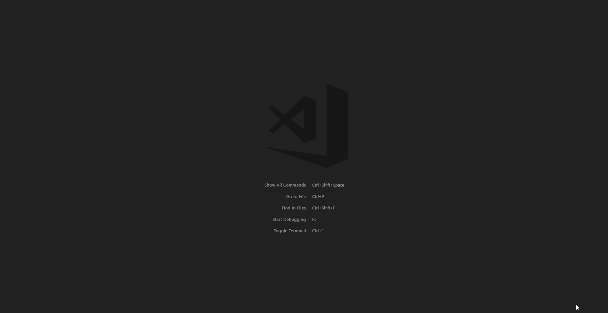

# VS-ORG (WIP)

This is a work in progress extension that will, in the end, try to emulate [Emacs Org-Mode](https://orgmode.org/) as much as possible.

## Features

Quickly create todo lists, organize your thoughts, schedule your todos and view them in an organized list(coming soon).

Create a new vso file: 

Headings and Subsections:  
-Using \* you can create Headings and sub Headings  
-The Number of \* determines the heading or section  
-Add TODO or DONE keywords to organize your lists and re-organize your list items: 

## Requirements

Make sure you save your files with the .vsorg extension. I will have a command that creates this file in the future.

## Extension Settings

**IMPORTANT:** make sure you set `files.insertFinalNewline": true` in the settings, formatting will break if it's not set (working on a fix).

## Keybinds

| Keys                  | Decription               |
| --------------------- | ------------------------ |
| `shift+rightArrow`    | add TODO or DONE Keyword |
| `shift+leftArrow`     | add DONE or TODO keyword |
| `shift+alt+UpArrow`   | Move Block of code Up    |
| `shift+alt+downArrow` | Move Block of code down  |

## Snippets

| Snippet   | Decription         | Output                  |
| --------- | ------------------ | ----------------------- |
| `/header` | insert page header | #+ TITLE:  #+ TAGS: |
|           |                    |                         |

## Known Issues

- When you alt+shift+arrow on the last line or the first line of document it won't swap places properly, the current fix is to make sure that always have a line below and above your content.

- alt+shift+down wont work on the top most line

## Release Notes

### 0.0.1

Initial release.

- Typing \* , ** , or \*** will properly format to "⊖ ", "⊙ ", "⊘ ".
- alt+shift+upArrow will swap the BLOCK of text with the BLOCK of text above it.
- alt+shift+downArrow will swap the BLOCK of text with the BLOCK of text below it.
- shift+rightArrow will add TODO or DONE keyword
- shift+rightLeft will add DONE or TODO keyword
- Fold and Unfold code with default keybinds ctrl+shift+] or [

## Upcoming Features

- Be able to schedule your TODOs
- VS Code side panel that will show all of Your Todos, and .vso docs.
- check boxes
- bulleted and numbered lists

---
